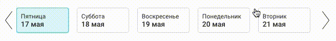

# react-spring-scroll-hook

Simple hook for creating smooth scroll list with arrows.



## Install

```
yarn add react-spring-scroll-hook
```

## Example

```
import useSpringScroll from 'react-spring-scroll-hook';

const {
  ref,
  onLeft: handlePrevClick,
  onWheel: handleWheel,
  onRight: handleRightClick
} = useSpringScroll();

return <div>
  

  <div className="overflow" onWheel={handleWheel}>
    {children}
  </div>

  
</div>
```
